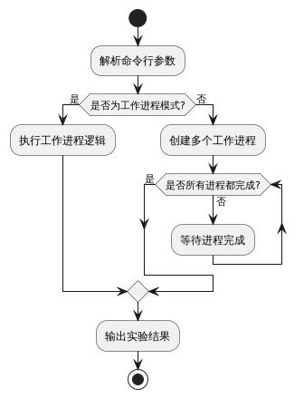
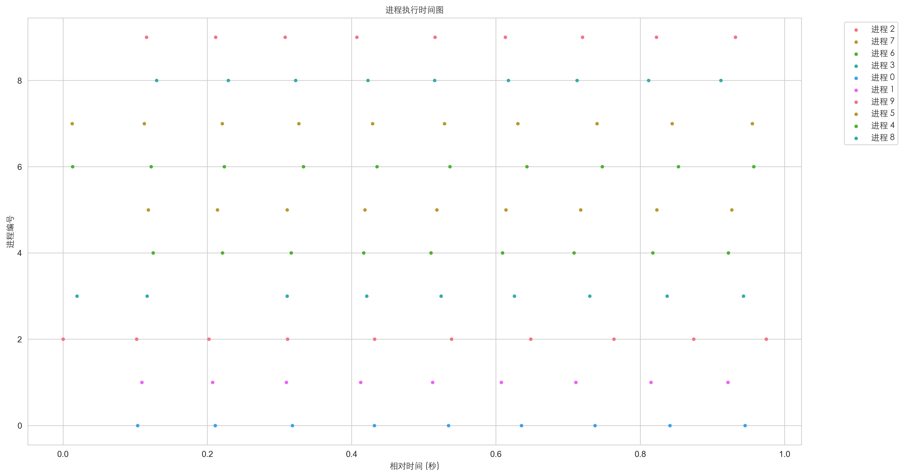
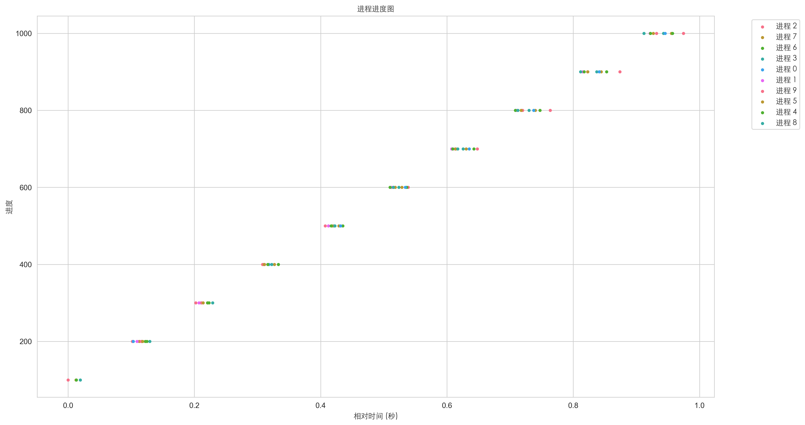
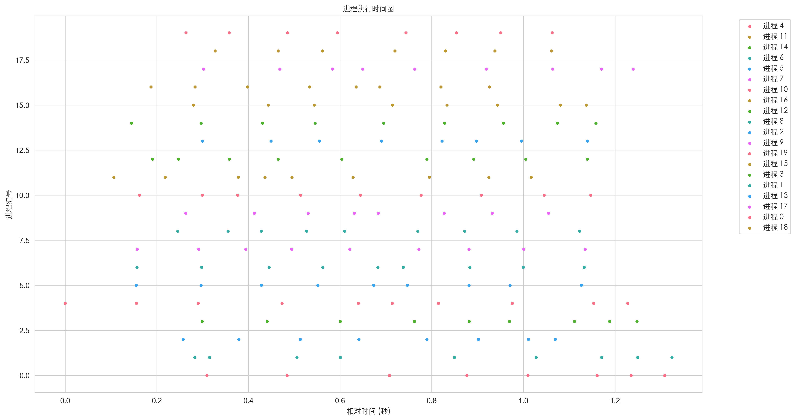
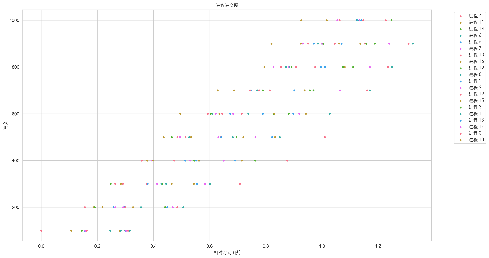
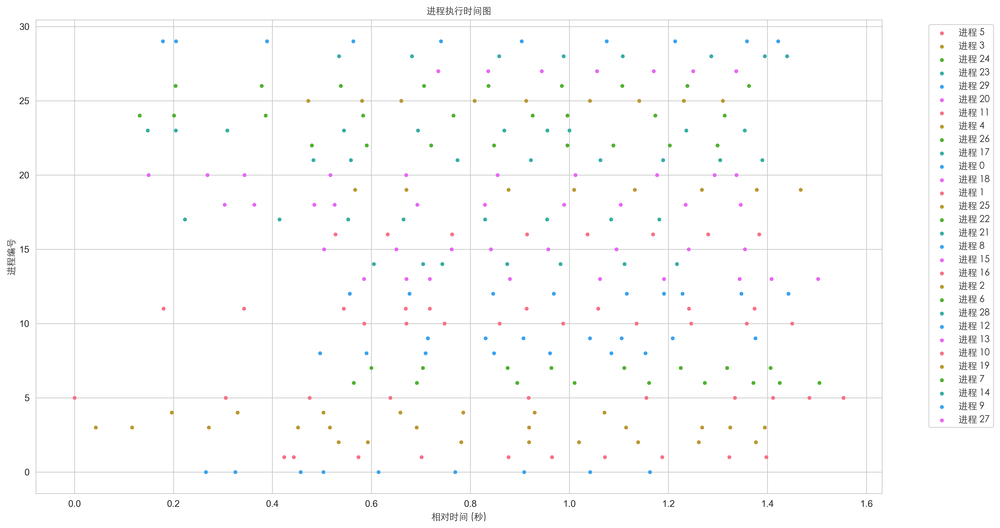
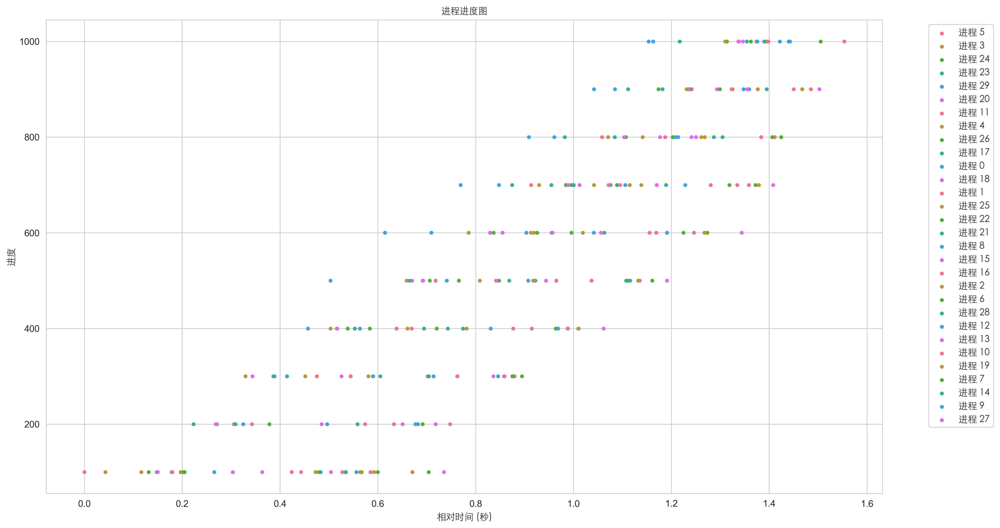

<h1 align="center">cpushed</h1>

<p align="center">模拟CPU调度分析工具</p>

来自《[試して理解]Linuxのしくみ ~実験と図解で学ぶOSとハードウェアの基礎知識》的一次实验，我使用 Golang 实现了类似的功能期望验证 CPU 并发调度逻辑。

## 快速开始

在本地有 Go 环境的情况下，执行以下命令：

```sh
$ go build -o cpusched
$ ./cpusched -n 24 -total 1000 -resol 10
```

或直接：`make debug`

## 详细说明

### 参数说明

| 参数 | 说明 |
|------|------|
| -n | CPU 核心数量 |
| -total | 运行总时间（毫秒） |
| -resol | 采样间隔（毫秒） |
| -h | 帮助信息 |
| -worker | 以工作进程模式运行 |
| -id | 工作进程ID |

### 实验逻辑



1. 程序启动后，首先解析命令行参数。
2. 如果是工作进程模式（-worker），则直接执行工作进程逻辑：
    - 循环执行模拟CPU密集型任务
    - 定期输出进度信息
3. 如果是主进程模式：
    - 根据指定的参数创建多个工作进程
    - 等待所有工作进程完成
    - 收集并输出所有进程的执行数据
4. 最后，输出实验结果到文件

### 实验结果

实验结束后，使用 `print.py` 脚本来分析结果：

```sh
$ python3 print.py ${file_num}
```

这个脚本会读取 `res${file_num}.txt` 文件，并生成两张图表：
1. 进程执行时间图 N=10：
   
2. 进程进度图 N=10：
   

再对比以下四张图：
1. 进程执行时间图 N=20：
   
2. 进程进度图 N=20：
   

3. 进程执行时间图 N=30：
   
4. 进程进度图 N=30：
   

## 证书

Apache License 2.0.